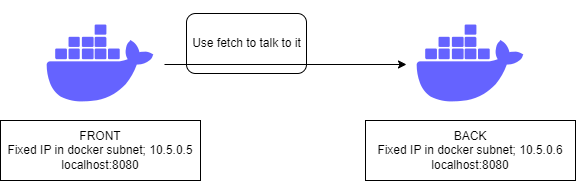

# Monster Bank

Hello dear all. This is the return of Monster bank !

## Installation

Unfortunately, there is an issue with the binding of the volume

This great monster catcher that I am was unable to solve it.

For now, I recommend running:

```
docker compose build

docker exec  web-lab-3-back npm install

docker exec  web-lab-3-front npm install
```
If the docker does not stay alive, you can change the command to
``sleep infinity``
Or if you have npm installed on your computer, 
you can do it directly on your machine

## Project description

So yeah, another monster bank.
This time, front and back are fully separated, and there is no database.
The reason ? Well, dear comrades, Database are a pain in the neck, and I don't like
JS as a backend solution. So I kept it simple. (PHP For the win !)

Your interested on how the heck this application work ? Good news for you !

Just keep reading !
# Documentation

## API

Back has 3 end point:

Get on "/"
=> Say hello word

Get on "/monsters"
=> Return the list of stored monster as json

Post on "/monsters"
=> Add given monster to the list

## Architecture

